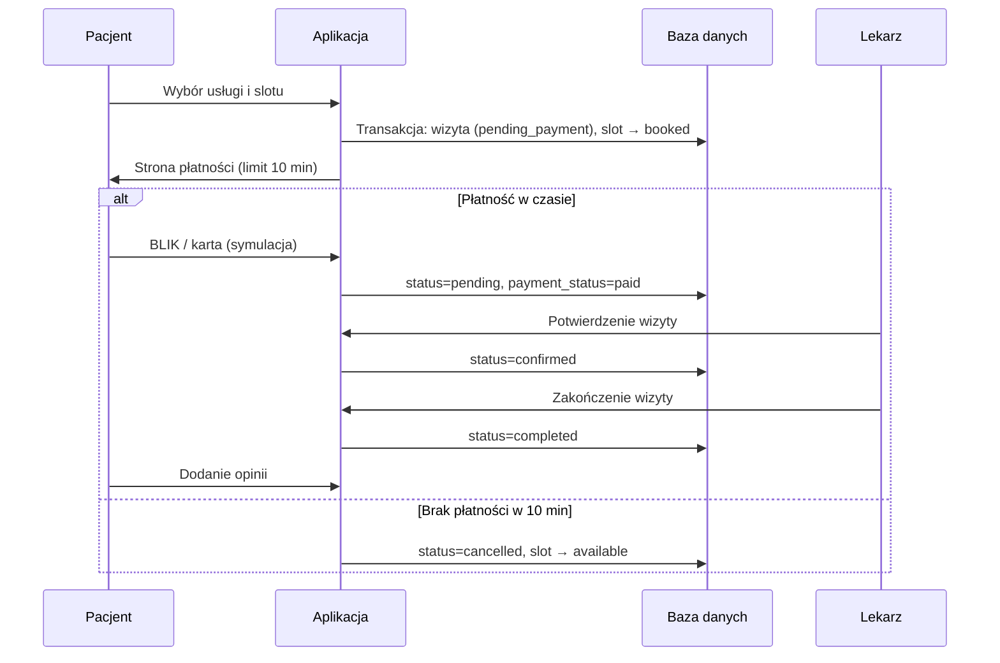

# Dokumentacja projektu — System Rezerwacji Wizyt Lekarskich

Repozytorium: [Aplikacja-System-Rezerwacji-Wizyt-Lekarskich-web](https://github.com/igorstyczen/Aplikacja-System-Rezerwacji-Wizyt-Lekarskich-web)

---

## 1. Autorzy i podział ról

Projekt wykonali: **Krystian Świąder** i **Igor Styczeń**.

### Krystian Świąder

**Logika rezerwacji**

- pobieranie wolnych slotów lekarza,
- sprawdzanie, czy termin jest wolny,
- tworzenie wizyty,
- blokowanie zajętego terminu,
- zmiana statusu wizyty,
- anulowanie wizyty,
- filtrowanie wizyt po lekarzu, pacjencie i statusie.

**Kalendarz i sloty dostępności**

- dodawanie slotów przez lekarza/admina,
- pobieranie slotów dla konkretnego lekarza,
- sprawdzanie kolizji godzin,
- oznaczanie slotów jako zajęte po rezerwacji.

**Pozostałe**

- strona główna z listą lekarzy,
- upload zdjęcia lekarza,
- upload zdjęć do opinii.

### Igor Styczeń

**Panel administratora — pełny CRUD**

- użytkownicy,
- lekarze,
- pacjenci,
- kliniki,
- usługi,
- wizyty,
- sloty dostępności,
- opinie.

**Wyszukiwarka i tagi**

- mechanizm filtrowania lekarzy na stronie głównej,
- wyszukiwanie po imieniu i nazwisku, specjalizacji, problemie zdrowotnym (tagu), mieście,
- filtrowanie informacji, czy lekarz przyjmuje dzieci.

**Profil lekarza**

- szczegółowy widok lekarza: dane osobowe, specjalizacje, opis, kliniki, usługi, dostępne terminy, opinie pacjentów,
- przejście ze strony głównej do profilu konkretnego lekarza,
- wyświetlenie informacji potrzebnych pacjentowi do umówienia wizyty.

---

## 2. Użyte technologie

### Backend

| Technologia | Wersja / rola |
|-------------|---------------|
| PHP | 8.2+ |
| Laravel | 12 |
| Laravel Breeze | Autentykacja, rejestracja, reset hasła |
| Eloquent ORM | Warstwa dostępu do bazy danych |
| MySQL | 8.0 — baza relacyjna |

### Frontend

| Technologia | Rola |
|-------------|------|
| Blade | Szablony HTML |
| Tailwind CSS 3 | Stylowanie |
| Alpine.js 3 | Interakcje po stronie klienta |
| Vite 7 | Budowanie assetów |

### Infrastruktura i narzędzia

| Technologia | Rola |
|-------------|------|
| Docker + Docker Compose | Uruchomienie aplikacji, PHP/Apache, MySQL, phpMyAdmin |
| Composer | Zależności PHP |
| npm | Zależności JavaScript |
| PHPUnit | Testy automatyczne |
| API NFZ (`api.nfz.gov.pl`) | Porównanie kolejek publicznych z terminami prywatnymi |

---

## 3. Przeznaczenie aplikacji

**System Rezerwacji Wizyt Lekarskich** to aplikacja webowa do zarządzania prywatnymi wizytami lekarskimi online.

Aplikacja jest przeznaczona dla:

- **pacjentów** — wyszukiwanie lekarzy, rezerwacja terminów, płatność, opinie,
- **lekarzy** — prowadzenie grafiku, usług i obsługa wizyt,
- **administratorów** — nadzór nad użytkownikami, klinikami, słownikami i wnioskami o profil lekarza,
- **użytkowników publicznych** — przegląd profili lekarzy i porównanie terminów prywatnych z kolejkami NFZ.

---

## 4. Opis funkcjonalności

### Funkcje publiczne (bez logowania)

- Strona główna z wyszukiwarką lekarzy (filtry: specjalizacja, miasto, tag problemu zdrowotnego).
- Podgląd profilu lekarza: bio, specjalizacje, kliniki, usługi, kalendarz terminów, opinie.
- Porównanie terminów prywatnych z kolejkami NFZ (integracja z publicznym API).

### Panel pacjenta

- Rejestracja i logowanie (automatyczne tworzenie profilu pacjenta).
- Rezerwacja wizyty: wybór usługi, terminu w kalendarzu tygodniowym (pon.–ndz.), potwierdzenie.
- Płatność testowa (BLIK lub karta) z limitem czasu 10 minut.
- Lista własnych wizyt ze statusami.
- Składanie opinii po zakończonej wizycie.
- Wniosek o utworzenie profilu lekarza.

### Panel lekarza

- Zarządzanie grafikiem: dodawanie, edycja, usuwanie slotów; powtarzanie co tydzień do wybranej daty.
- Zarządzanie usługami medycznymi (cena, czas trwania, klinika).
- Przegląd i obsługa wizyt (potwierdzenie, zakończenie).
- Edycja profilu lekarza, w tym dodawanie tagów problemów zdrowotnych (z wykrywaniem podobnych tagów).

### Panel administratora

- Dashboard ze statystykami (użytkownicy, lekarze, wizyty).
- Zarządzanie użytkownikami (edycja roli, aktywacja/dezaktywacja).
- Zarządzanie lekarzami (weryfikacja, tworzenie, edycja).
- Zarządzanie klinikami (lista z filtrami, dodawanie, osobny widok edycji, przypisywanie lekarzy).
- Obsługa wniosków o profil lekarza (akceptacja / odrzucenie).
- Zarządzanie słownikami: specjalizacje, tagi problemów zdrowotnych.
- Podgląd i obsługa wszystkich wizyt.

### Role i uprawnienia

| Rola | Wartość w bazie | Dostęp |
|------|-----------------|--------|
| Administrator | `admin` | Pełny panel admina |
| Lekarz | `doctor` | Panel lekarza (+ funkcje pacjenta, jeśli ma profil pacjenta) |
| Pacjent | `patient` | Panel pacjenta |

Jeden użytkownik może mieć **równocześnie** profil lekarza i pacjenta (np. lekarz rezerwujący wizytę u innego specjalisty).

---

## 5. Schemat ERD

Poniższy schemat w formacie **DBML** można wkleić na dbdiagram.io (https://dbdiagram.io) w celu wygenerowania diagramu ERD.

```dbml
Table users {
  id bigint [pk, increment]
  name varchar
  email varchar [unique]
  email_verified_at timestamp [null]
  password varchar
  role varchar [default: 'patient'] // admin, doctor, patient
  phone varchar [null]
  is_active boolean [default: true]
  remember_token varchar [null]
  created_at timestamp
  updated_at timestamp
}

Table doctors {
  id bigint [pk, increment]
  user_id bigint [unique, ref: > users.id]
  first_name varchar
  last_name varchar
  photo_url varchar [null]
  bio text [null]
  is_verified boolean [default: false]
  is_for_adults boolean [default: true]
  is_for_children boolean [default: false]
  is_active boolean [default: true]
  created_at timestamp
  updated_at timestamp
}

Table patients {
  id bigint [pk, increment]
  user_id bigint [unique, ref: > users.id]
  first_name varchar
  last_name varchar
  pesel varchar [null]
  phone varchar [null]
  created_at timestamp
  updated_at timestamp
}

Table clinics {
  id bigint [pk, increment]
  name varchar
  address varchar
  city varchar
  details text [null]
  created_at timestamp
  updated_at timestamp
}

Table clinic_doctor {
  clinic_id bigint [ref: > clinics.id]
  doctor_id bigint [ref: > doctors.id]
  created_at timestamp
  updated_at timestamp

  indexes {
    (clinic_id, doctor_id) [pk]
  }
}

Table specializations {
  id bigint [pk, increment]
  name varchar [unique]
  created_at timestamp
  updated_at timestamp
}

Table doctor_specializations {
  id bigint [pk, increment]
  doctor_id bigint [ref: > doctors.id]
  specialization_id bigint [ref: > specializations.id]
  created_at timestamp
  updated_at timestamp
}

Table help_tags {
  id bigint [pk, increment]
  name varchar [unique]
  created_at timestamp
  updated_at timestamp
}

Table doctors_help_tags {
  doctor_id bigint [ref: > doctors.id]
  help_tag_id bigint [ref: > help_tags.id]

  indexes {
    (doctor_id, help_tag_id) [pk]
  }
}

Table services {
  id bigint [pk, increment]
  doctor_id bigint [ref: > doctors.id]
  clinic_id bigint [ref: > clinics.id]
  name varchar
  description text [null]
  price decimal
  duration_minutes int
  created_at timestamp
  updated_at timestamp
}

Table availability_slots {
  id bigint [pk, increment]
  doctor_id bigint [ref: > doctors.id]
  clinic_id bigint [ref: > clinics.id]
  start_time datetime
  end_time datetime
  is_recurring boolean [default: false]
  recurrence_rule varchar [null]
  status varchar [default: 'available'] // available, booked
  created_at timestamp
  updated_at timestamp
}

Table appointments {
  id bigint [pk, increment]
  patient_id bigint [ref: > patients.id]
  doctor_id bigint [ref: > doctors.id]
  service_id bigint [ref: > services.id]
  clinic_id bigint [ref: > clinics.id]
  date timestamp
  length int
  status varchar [default: 'pending'] // pending_payment, pending, confirmed, completed, cancelled
  payment_status varchar [default: 'unpaid']
  payment_method varchar [null]
  payment_amount decimal [null]
  paid_at timestamp [null]
  created_at timestamp
  updated_at timestamp
}

Table reviews {
  id bigint [pk, increment]
  appointment_id bigint [unique, ref: > appointments.id]
  doctor_id bigint [ref: > doctors.id]
  rating tinyint
  comment text [null]
  created_at timestamp
  updated_at timestamp
}

Table doctor_applications {
  id bigint [pk, increment]
  user_id bigint [ref: > users.id]
  first_name varchar
  last_name varchar
  phone varchar [null]
  bio text [null]
  is_for_adults boolean [default: true]
  is_for_children boolean [default: false]
  status varchar [default: 'pending'] // pending, approved, rejected
  admin_note text [null]
  reviewed_at timestamp [null]
  specialization varchar [null]
  clinic_name varchar [null]
  clinic_address varchar [null]
  clinic_city varchar [null]
  help_tag_ids json [null]
  created_at timestamp
  updated_at timestamp
}
```

### Relacje (skrót)

```
users 1──1 doctors
users 1──1 patients
doctors N──M clinics (clinic_doctor)
doctors N──M specializations (doctor_specializations)
doctors N──M help_tags (doctors_help_tags)
doctors 1──N services
doctors 1──N availability_slots
clinics 1──N services
clinics 1──N availability_slots
patients 1──N appointments
doctors 1──N appointments
services 1──N appointments
appointments 1──0..1 reviews
users 1──N doctor_applications
```

---

## 6. Kierunki dalszego rozwoju

### Co zrobilibyśmy innaczej

- **Warstwa API** — wydzielenie REST API (np. dla aplikacji mobilnej) zamiast logiki wyłącznie w kontrolerach Blade.
- **Front-end SPA** — rozważenie Vue/React dla bardziej interaktywnego kalendarza i paneli, zamiast mieszanki Blade + inline JS.
- **Testy** — szersze pokrycie testami Feature (rezerwacja, płatność, timeout, role) już na etapie implementacji.
- **Konfiguracja środowiska** — jeden skrypt `setup` uruchamiany przy pierwszym `docker compose up`, zamiast ręcznych kroków migracji i buildu.

### Co wymaga dopracowania

- **Płatności** — integracja z prawdziwym bramką płatności (PayU, Przelewy24, Stripe).
- **Powiadomienia** — e-mail/SMS o rezerwacji, przypomnienia przed wizytą, anulowanie po timeoutie.
- **Weryfikacja e-mail** — obecnie wymagana przez część tras; w środowisku demo wymaga ręcznego oznaczenia kont.
- **Bezpieczeństwo i RODO** — audyt przechowywania danych wrażliwych (PESEL), polityka prywatności, logi dostępu.
- **Wydajność** — cache wyników API NFZ, indeksy na często filtrowanych kolumnach (miasto, data slotu).
- **Dostępność (a11y)** — poprawa kontrastów, etykiet formularzy i nawigacji klawiaturą.
- **Panel lekarza** — masowe generowanie grafiku, wyjątki od reguł cyklicznych (święta, urlopy).

---

## 7. Instrukcja krok po kroku uruchomienia aplikacji

### Wymagania

- Docker Desktop (uruchomiony)
- Git (opcjonalnie, do klonowania repozytorium)

### Krok 1 — Pobranie projektu

```powershell
git clone https://github.com/igorstyczen/Aplikacja-System-Rezerwacji-Wizyt-Lekarskich-web.git
cd Aplikacja-System-Rezerwacji-Wizyt-Lekarskich-web
```

### Krok 2 — Uruchomienie kontenerów

```powershell
docker compose up -d --build
```

Pierwsze uruchomienie może trwać kilka minut (instalacja zależności PHP w wolumenie Docker).

### Krok 3 — Konfiguracja aplikacji (tylko przy pierwszym uruchomieniu)

```powershell
docker exec medical_app php artisan key:generate
docker exec medical_app php artisan storage:link
docker exec medical_app php artisan migrate --seed --force
docker exec medical_app npm install
docker exec medical_app npm run build
```

### Krok 4 — Weryfikacja e-maili kont demo (zalecane)

```powershell
docker exec medical_app php artisan tinker --execute="App\Models\User::query()->update(['email_verified_at' => now()]);"
```

### Krok 5 — Otwarcie aplikacji

| Usługa | Adres |
|--------|-------|
| Aplikacja | http://localhost:8000 |
| phpMyAdmin | http://localhost:8080 |

**phpMyAdmin:** serwer `db`, użytkownik `laravel`, hasło `secret`, baza `medical_booking`.

### Konta testowe

| E-mail | Hasło | Rola |
|--------|-------|------|
| admin@test.pl | password | Administrator |
| doktor1@test.pl | password | Lekarz |
| pacjent1@test.pl | password | Pacjent |

### Przydatne komendy

```powershell
# Zatrzymanie
docker compose down

# Ponowne seedowanie (czyści dane!)
docker exec medical_app php artisan migrate:fresh --seed --force

# Po zmianie kodu / .env
docker exec medical_app php artisan optimize:clear
docker compose restart app
```

Szczegółowa instrukcja (wariant bez Docker, VS Code, rozwiązywanie problemów): [docs/INSTALACJA.md](INSTALACJA.md).

---

## 8. Wybrany, reprezentatywny przebieg użycia aplikacji / logiki biznesowej

Poniżej opisano **główny przepływ biznesowy**: rezerwacja wizyty przez pacjenta — od wyszukania lekarza do potwierdzenia przez lekarza.

### Krok 1 — Wyszukanie lekarza

1. Pacjent wchodzi na stronę główną (`/`).
2. Ustawia filtry (np. specjalizacja „Kardiologia”, miasto „Warszawa”).
3. Klika profil wybranego lekarza (`/doctors/{id}`).

### Krok 2 — Wybór usługi i terminu

1. Na profilu lekarza pacjent **najpierw wybiera usługę** (np. „Konsultacja — 150 zł, 30 min”).
2. Bez wybranej usługi kalendarz terminów jest zablokowany.
3. Pacjent przegląda kalendarz tygodniowy (poniedziałek–niedziela) i klika wolny slot.
4. Potwierdza rezerwację formularzem (`POST /appointments`).

### Krok 3 — Rezerwacja w bazie (transakcja)

Aplikacja w jednej transakcji bazy danych:

1. Blokuje wiersz slotu (`lockForUpdate`).
2. Sprawdza, czy slot ma status `available`.
3. Tworzy wizytę ze statusem `pending_payment`.
4. Ustawia slot na `booked`.

Jeśli slot został zajęty równolegle przez innego użytkownika — zwracany jest komunikat błędu.

### Krok 4 — Płatność (symulacja, limit 10 minut)

1. Pacjent trafia na stronę płatności (`/appointments/{id}/payment`).
2. Wybiera metodę: BLIK (6 cyfr) lub karta (16 cyfr + data + CVV).
3. Po „opłaceniu” wizyta przechodzi w status `pending`, płatność `paid`.

**Timeout:** jeśli pacjent nie opłaci wizyty w ciągu 10 minut, wizyta jest anulowana (`cancelled`), a slot wraca do statusu `available`.

### Krok 5 — Potwierdzenie przez lekarza

1. Lekarz loguje się i otwiera **Moje wizyty** (`/doctor/appointments`).
2. Widzi opłaconą wizytę ze statusem `pending`.
3. Klika **Potwierdź** — status zmienia się na `confirmed`.

Administrator może wykonać te same operacje z panelu `/admin/appointments`.

### Krok 6 — Realizacja wizyty i opinia

1. Po wizycie lekarz (lub admin) oznacza ją jako `completed`.
2. Pacjent w **Moje wizyty** może dodać opinię (ocena 1–5 + komentarz).
3. Opinia jest widoczna na profilu lekarza.

### Diagram sekwencji



### Statusy wizyty

| Status | Znaczenie |
|--------|-----------|
| `pending_payment` | Termin zarezerwowany, oczekuje płatności |
| `pending` | Opłacona, czeka na potwierdzenie lekarza |
| `confirmed` | Potwierdzona przez lekarza/admina |
| `completed` | Zrealizowana |
| `cancelled` | Anulowana (np. brak płatności) |

---

## Załączniki

- [Instalacja — szczegóły i rozwiązywanie problemów](INSTALACJA.md)
- [Zrzuty ekranu](screenshots/) — folder `docs/screenshots/`
- [Historia zmian](../CHANGELOG.md)
