# Dokumentacja projektu — System Rezerwacji Wizyt Lekarskich

## 1. Wprowadzenie

**System Rezerwacji Wizyt Lekarskich** to aplikacja webowa umożliwiająca:

- pacjentom **wyszukiwanie lekarzy** i **rezerwację wizyt** online,
- lekarzom **zarządzanie grafikiem**, usługami i wizytami,
- administratorom **nadzór** nad użytkownikami, klinikami i wnioskami o profil lekarza,
- wszystkim użytkownikom **porównanie terminów prywatnych z kolejkami NFZ**.

Aplikacja jest napisana w **Laravel 12** (PHP 8.2+) z autentykacją **Laravel Breeze** i interfejsem **Blade + Tailwind CSS**.

---

## 2. Zrzuty ekranu

> Zrzuty ekranu znajdują się w folderze [`screenshots/`](./screenshots/). Jeśli podgląd Markdown ich nie pokazuje, otwórz plik ponownie lub użyj **Markdown: Open Preview** (`Ctrl+Shift+V`).

### Strona publiczna

#### Strona główna — wyszukiwarka lekarzy

<p align="center">
  
</p>

Hero z opisem platformy, filtry (specjalizacja, miasto, tag problemu zdrowotnego) oraz lista zweryfikowanych lekarzy.

#### Logowanie

<p align="center">
  
</p>

Formularz logowania z opcją „Remember me” i resetem hasła.

#### Rejestracja

<p align="center">
  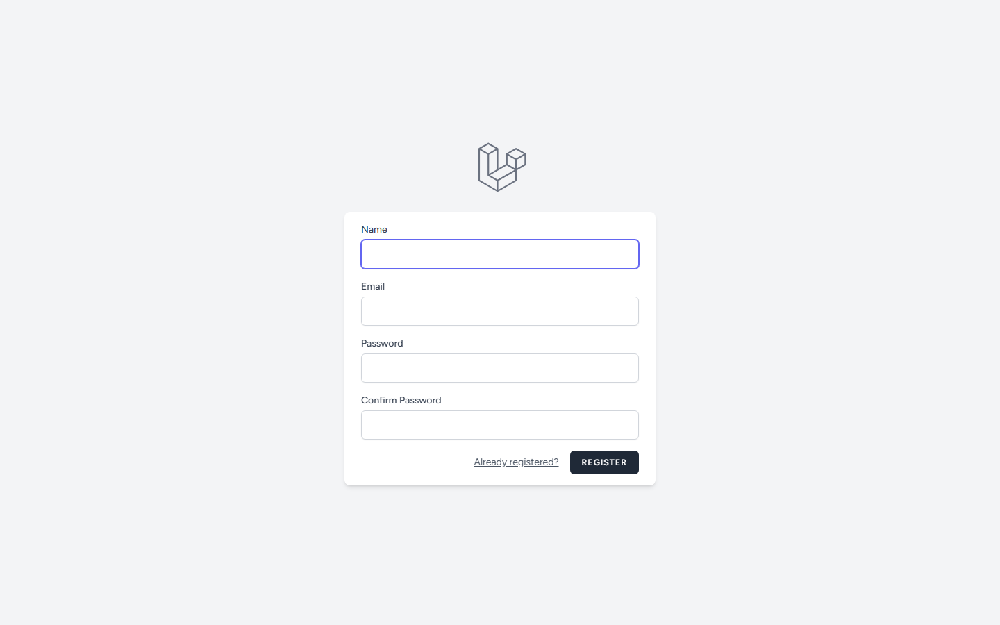
</p>

Rejestracja tworzy konto z rolą `patient` oraz automatycznie profil pacjenta.

#### Porównanie z NFZ

<p align="center">
  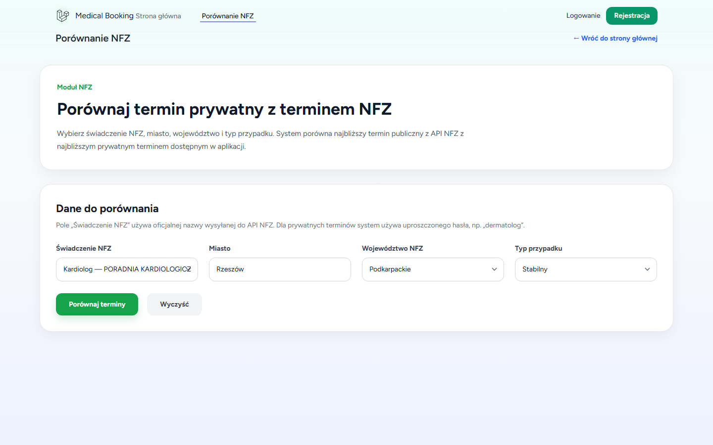
</p>

Integracja z publicznym API NFZ — wyszukiwanie kolejek i porównanie z najbliższym terminem prywatnym.

#### Profil lekarza

<p align="center">
  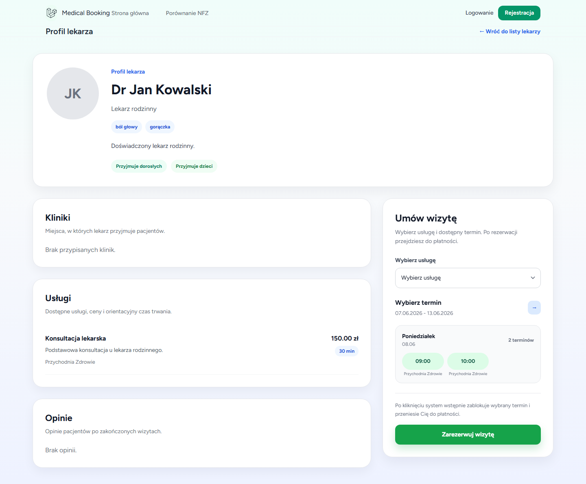
</p>

Szczegóły lekarza: specjalizacje, kliniki, usługi, dostępne terminy, opinie pacjentów.

---

### Panel pacjenta

<p align="center">
  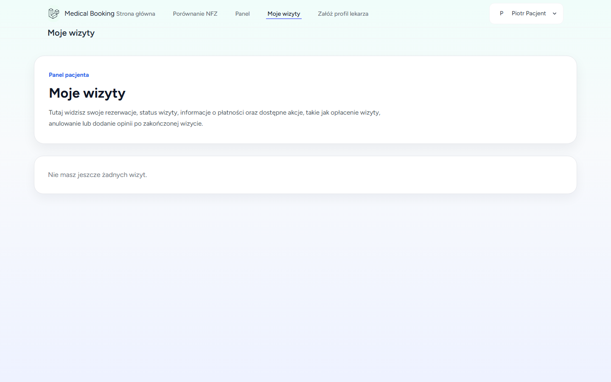
</p>

Lista wizyt pacjenta ze statusami (oczekuje płatności, opłacona, potwierdzona, zakończona, anulowana).

---

### Panel lekarza

#### Grafik

<p align="center">
  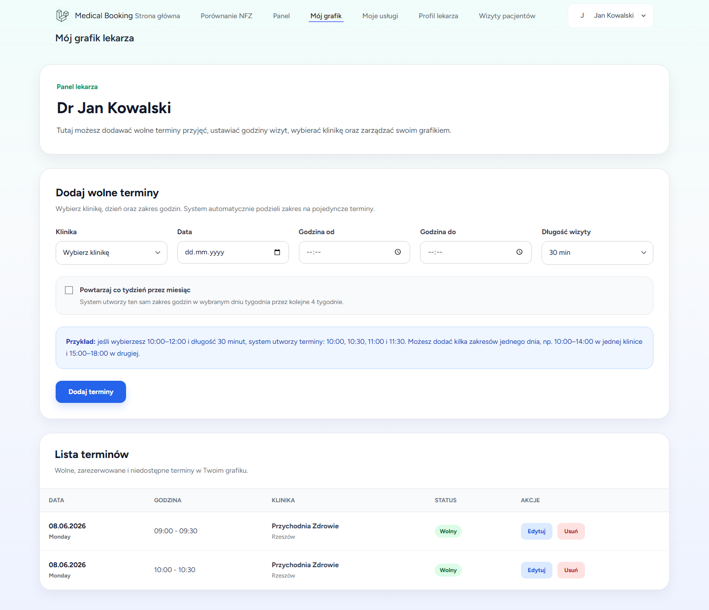
</p>

Dodawanie, edycja i usuwanie slotów dostępności powiązanych z kliniką.

#### Wizyty

<p align="center">
  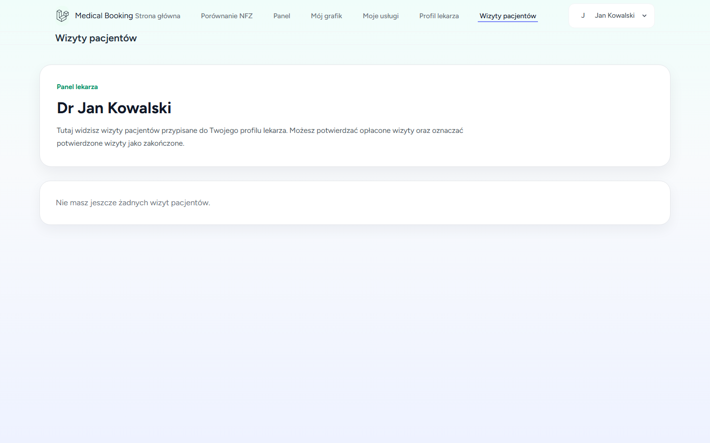
</p>

Przegląd i obsługa wizyt (potwierdzenie, zakończenie).

---

### Panel administratora

#### Dashboard

<p align="center">
  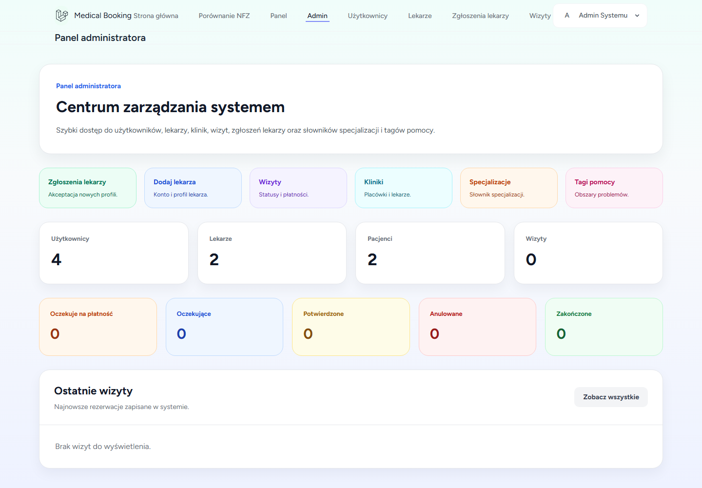
</p>

Statystyki: użytkownicy, lekarze, pacjenci, wizyty wg statusu, ostatnie rezerwacje.

#### Zarządzanie lekarzami

<p align="center">
  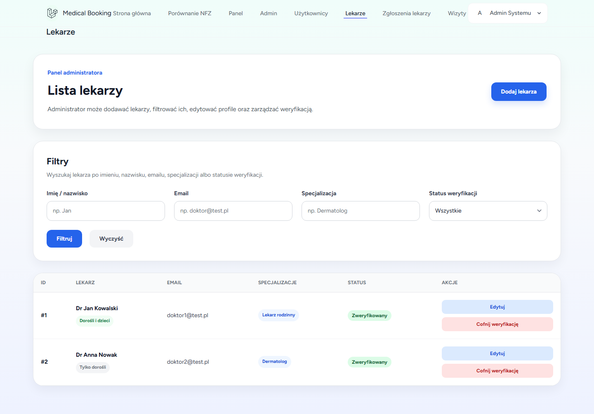
</p>

Lista lekarzy z filtrowaniem, weryfikacją, aktywacją/dezaktywacją.

---

## 3. Role użytkowników

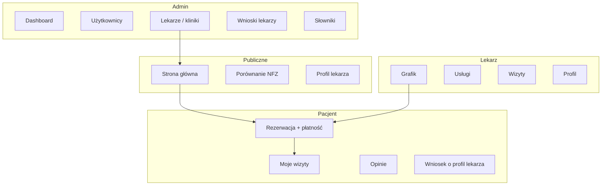

| Rola | Wartość `users.role` | Middleware |
|------|----------------------|------------|
| Administrator | `admin` | `auth`, `role:admin` |
| Lekarz | `doctor` | `auth`, `role:doctor,admin` |
| Pacjent | `patient` | `auth`, `role:patient,admin` |

**Uwaga:** Jeden użytkownik może mieć **równocześnie** profil lekarza (`doctors`) i pacjenta (`patients`) — np. lekarz rezerwujący wizytę u innego specjalisty.

---

## 4. Przepływ rezerwacji wizyty

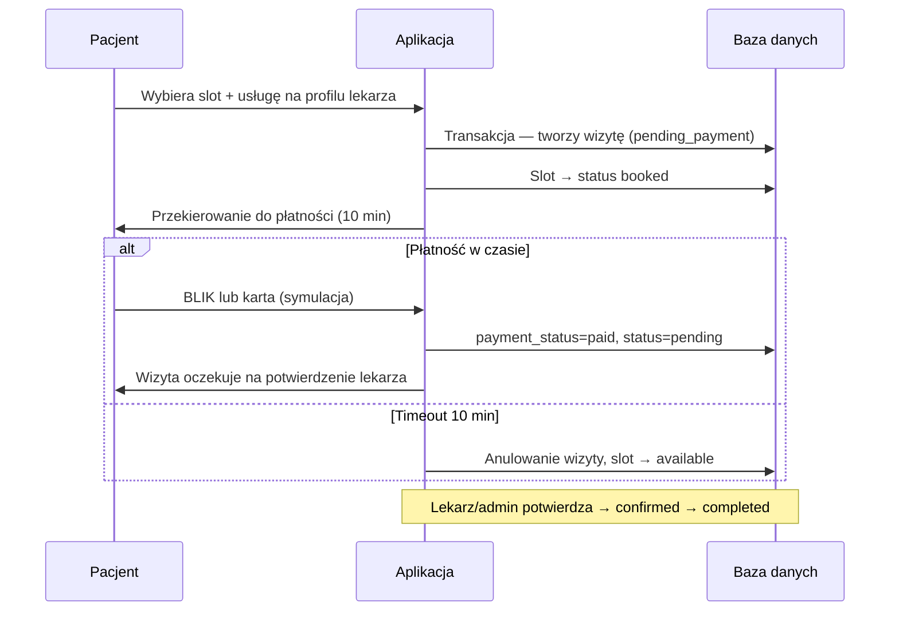

### Statusy wizyty (`appointments.status`)

| Status | Opis |
|--------|------|
| `pending_payment` | Termin zablokowany, oczekuje płatności (max 10 min) |
| `pending` | Opłacona, oczekuje potwierdzenia lekarza |
| `confirmed` | Potwierdzona przez lekarza/admina |
| `completed` | Zrealizowana |
| `cancelled` | Anulowana |

### Płatność testowa

Płatność jest **symulowana** — nie łączy się z prawdziwym operatorem płatności.

- **BLIK:** 6 cyfr
- **Karta:** 16 cyfr + MM/RR + CVV

---

## 5. Integracja z API NFZ

Serwis `App\Services\NfzApiService` komunikuje się z:

```
https://api.nfz.gov.pl/app-itl-api/queues
```

Parametry: `benefit`, `locality`, `province`, `case`.

Aplikacja:

1. Wyszukuje najbliższy **prywatny termin** w bazie (dopasowanie po usłudze/specjalizacji/mieście).
2. Pobiera **kolejki NFZ** z API.
3. Oblicza **różnicę w dniach** między terminem prywatnym a najbliższą datą NFZ.

Trasy: `/nfz-comparison`, `/nfz-comparison/compare`.

---

## 6. Model danych

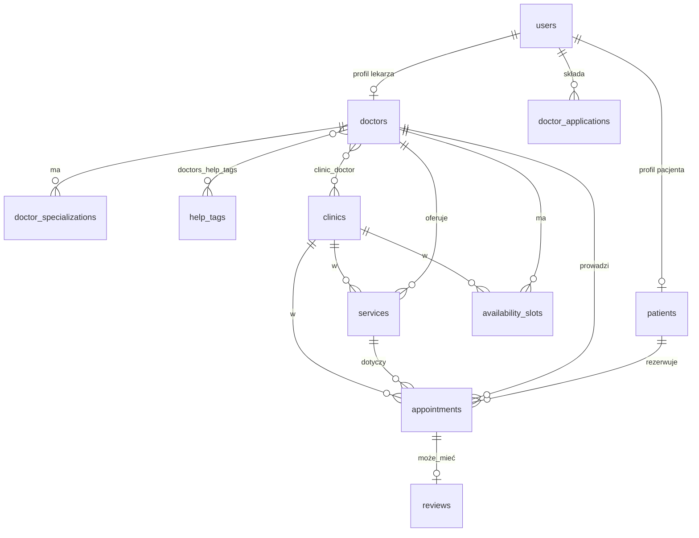

### Główne tabele

| Tabela | Opis |
|--------|------|
| `users` | Konta logowania, rola, aktywność |
| `doctors` | Profil lekarza, weryfikacja, grupy wiekowe |
| `patients` | Profil pacjenta (PESEL, telefon) |
| `clinics` | Przychodnie / gabinety |
| `services` | Usługi medyczne z ceną i czasem trwania |
| `availability_slots` | Terminy w grafiku (`available`, `booked`) |
| `appointments` | Rezerwacje wizyt + dane płatności |
| `reviews` | Opinie po zakończonej wizycie |
| `doctor_applications` | Wnioski pacjentów o utworzenie profilu lekarza |
| `specializations` | Słownik specjalizacji (admin) |
| `help_tags` | Tagi problemów zdrowotnych (admin) |

---

## 7. Architektura aplikacji

```
Aplikacja-System-Rezerwacji-Wizyt-Lekarskich-web/
├── app/
│   ├── Http/Controllers/     # Logika HTTP (MVC)
│   ├── Http/Middleware/      # RoleMiddleware
│   ├── Http/Requests/        # Walidacja formularzy
│   ├── Models/               # Eloquent ORM
│   └── Services/             # NfzApiService
├── database/
│   ├── migrations/           # Schemat bazy
│   └── seeders/              # DemoDataSeeder
├── resources/views/          # Szablony Blade
├── routes/
│   ├── web.php               # Trasy aplikacji
│   └── auth.php              # Trasy Breeze
├── public/                   # Punkt wejścia (index.php)
├── docker/                   # Konfiguracja Apache/PHP
└── docker-compose.yml
```

### Wzorce

- **MVC** — kontrolery, modele, widoki Blade
- **Middleware `role`** — kontrola dostępu wg roli
- **Serwisy** — logika zewnętrzna (API NFZ)
- **Transakcje DB** — rezerwacje i płatności (blokada wierszy `lockForUpdate`)

---

## 8. Mapa tras (skrót)

| Trasa | Opis |
|-------|------|
| `GET /` | Strona główna |
| `GET /doctors/{id}` | Profil lekarza |
| `POST /appointments` | Rezerwacja |
| `GET /appointments/{id}/payment` | Płatność |
| `GET /my-appointments` | Panel pacjenta |
| `GET /doctor/schedule` | Grafik lekarza |
| `GET /doctor/appointments` | Wizyty lekarza |
| `GET /admin/dashboard` | Panel admina |
| `GET /nfz-comparison` | Porównanie NFZ |
| `GET /doctor-application` | Wniosek o profil lekarza |

Pełna lista: plik `routes/web.php`.

---

## 9. Wnioski o profil lekarza

Pacjent (lub admin) może złożyć wniosek o utworzenie profilu lekarza. Administrator:

- **akceptuje** — tworzy konto lekarza, profil, specjalizacje, klinikę,
- **odrzuca** — wniosek pozostaje w historii ze statusem `rejected`.

Trasa admina: `/admin/doctor-applications`.

---

## 10. Bezpieczeństwo

- Hasła hashowane (bcrypt)
- CSRF na formularzach
- Middleware autoryzacji i ról
- Dezaktywacja kont (`users.is_active`)
- Weryfikacja e-mail (Laravel Breeze) — trasa `/dashboard` wymaga `verified`
- Blokada terminów z timeoutem płatności (10 min)

---

## 11. Testy

```powershell
# W kontenerze Docker
docker exec medical_app php artisan test

# Lokalnie
composer test
```

Testy Feature obejmują m.in. autentykację Breeze i profil użytkownika (`tests/Feature/`).

---

## 12. Ponowne generowanie screenshotów

W folderze `docs/` znajduje się skrypt Playwright:

```powershell
cd docs
npm install
npx playwright install chromium
node capture-screenshots.mjs
```

Wymaga uruchomionej aplikacji na `http://localhost:8000` i zaseedowanej bazy.

---

## 13. Zależności

### PHP (`composer.json`)

- `laravel/framework` ^12.0
- `laravel/tinker` ^2.10

### Dev

- `laravel/breeze` — autentykacja
- `laravel/sail` — Docker (alternatywa)
- `phpunit/phpunit` — testy

### JavaScript (`package.json`)

- Vite 7, Tailwind CSS 3, Alpine.js 3

---

## 14. Autorzy i przeznaczenie

Projekt wykonali: **Krystian Świąder** i **Igor Styczeń**.

Projekt stanowi **system rezerwacji wizyt lekarskich** — typowo projekt zaliczeniowy / portfolio. Płatności i integracje są uproszczone do celów demonstracyjnych.
