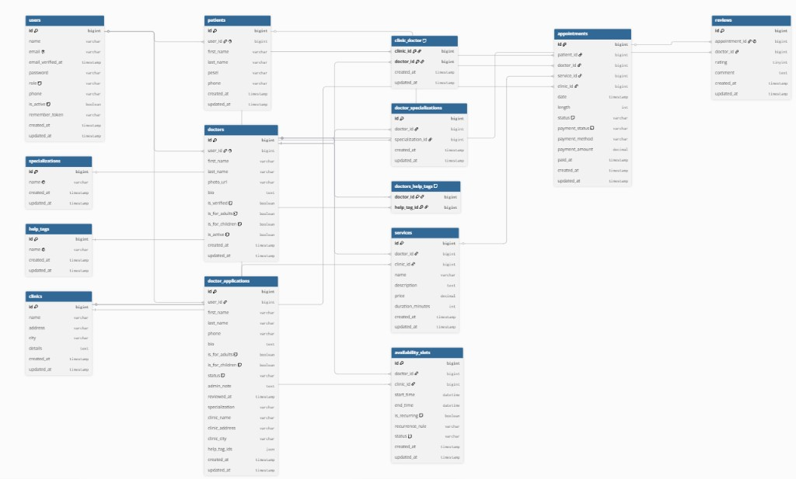
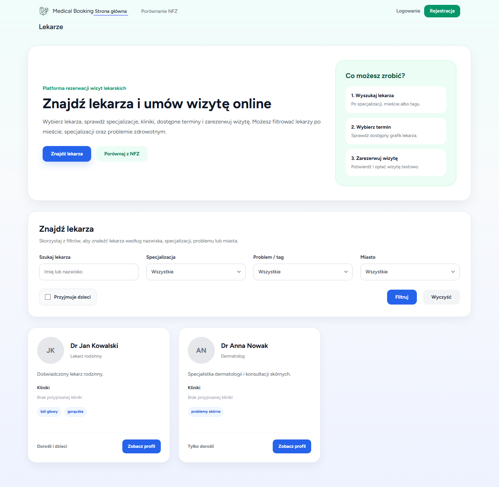
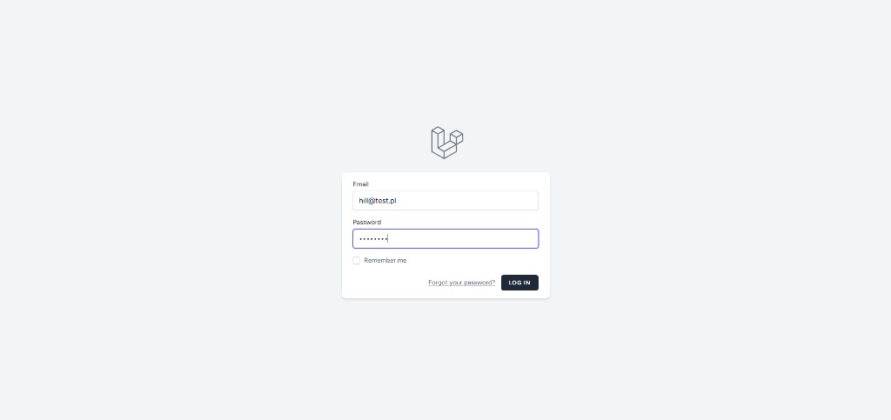
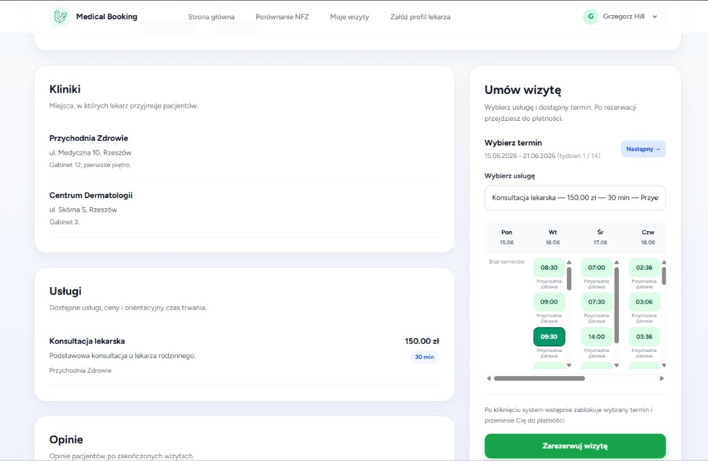
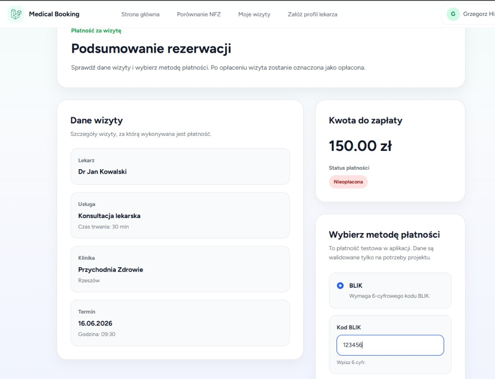
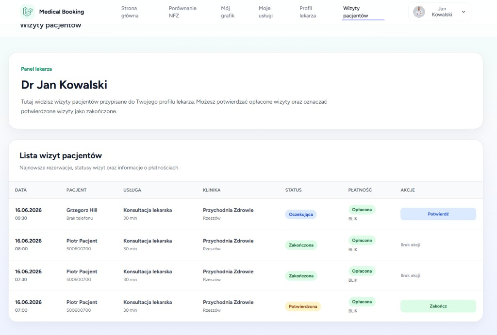
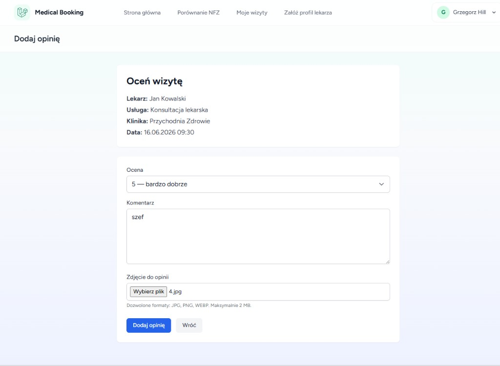
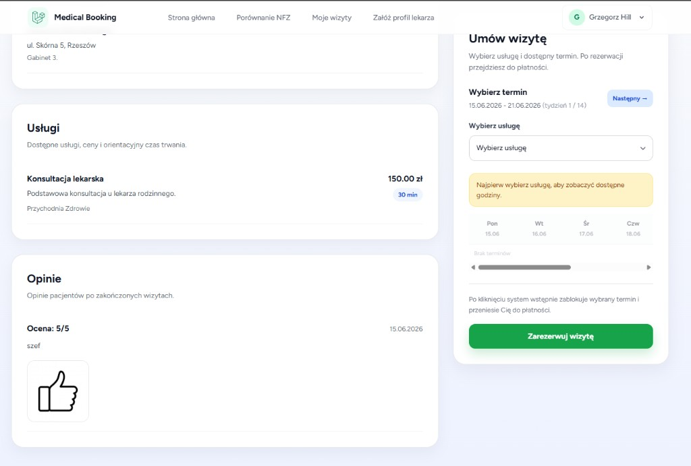

# Dokumentacja projektu — System Rezerwacji Wizyt Lekarskich

Repozytorium: [Aplikacja-System-Rezerwacji-Wizyt-Lekarskich-web](https://github.com/igorstyczen/Aplikacja-System-Rezerwacji-Wizyt-Lekarskich-web)

---

## Opis projektu

**System Rezerwacji Wizyt Lekarskich** to aplikacja webowa do zarządzania prywatnymi wizytami lekarskimi online. Umożliwia pacjentom wyszukanie lekarza, rezerwację wolnego terminu, opłacenie wizyty oraz wystawienie opinii po jej zakończeniu. Lekarze prowadzą grafik dostępności, usługi i obsługują wizyty pacjentów. Administrator nadzoruje użytkowników, kliniki, słowniki oraz wnioski o utworzenie profilu lekarza.

Aplikacja jest przeznaczona dla:

- **pacjentów** — wyszukiwanie lekarzy, rezerwacja terminów, płatność, opinie,
- **lekarzy** — prowadzenie grafiku, usług i obsługa wizyt,
- **administratorów** — nadzór nad użytkownikami, klinikami, słownikami i wnioskami o profil lekarza,
- **użytkowników publicznych** — przegląd profili lekarzy i porównanie terminów prywatnych z kolejkami NFZ.

Technologie: **Laravel 12** (PHP 8.2+), **MySQL**, **Blade**, **Tailwind CSS**, **Alpine.js**, **Docker**.

---

## 1. Autorzy i podział ról

Projekt wykonali: **Krystian Świąder** i **Igor Styczeń**.

### Krystian Świąder

**Logika rezerwacji**

- pobieranie wolnych slotów lekarza,
- sprawdzanie, czy termin jest wolny,
- tworzenie wizyty,
- blokowanie zajętego terminu,
- zmiana statusu wizyty,
- anulowanie wizyty,
- filtrowanie wizyt po lekarzu, pacjencie i statusie.

**Kalendarz i sloty dostępności**

- dodawanie slotów przez lekarza/admina,
- pobieranie slotów dla konkretnego lekarza,
- sprawdzanie kolizji godzin,
- oznaczanie slotów jako zajęte po rezerwacji.

**Pozostałe**

- strona główna z listą lekarzy,
- upload zdjęcia lekarza,
- upload zdjęć do opinii.

### Igor Styczeń

**Panel administratora — pełny CRUD**

- użytkownicy,
- lekarze,
- pacjenci,
- kliniki,
- usługi,
- wizyty,
- sloty dostępności,
- opinie.

**Wyszukiwarka i tagi**

- mechanizm filtrowania lekarzy na stronie głównej,
- wyszukiwanie po imieniu i nazwisku, specjalizacji, problemie zdrowotnym (tagu), mieście,
- filtrowanie informacji, czy lekarz przyjmuje dzieci.

**Profil lekarza**

- szczegółowy widok lekarza: dane osobowe, specjalizacje, opis, kliniki, usługi, dostępne terminy, opinie pacjentów,
- przejście ze strony głównej do profilu konkretnego lekarza,
- wyświetlenie informacji potrzebnych pacjentowi do umówienia wizyty.

---

## 2. Użyte technologie

### Backend

| Technologia | Wersja / rola |
|-------------|---------------|
| PHP | 8.2+ |
| Laravel | 12 |
| Laravel Breeze | Autentykacja, rejestracja, reset hasła |
| Eloquent ORM | Warstwa dostępu do bazy danych |
| MySQL | 8.0 — baza relacyjna |

### Frontend

| Technologia | Rola |
|-------------|------|
| Blade | Szablony HTML |
| Tailwind CSS 3 | Stylowanie |
| Alpine.js 3 | Interakcje po stronie klienta |
| Vite 7 | Budowanie assetów |

### Infrastruktura i narzędzia

| Technologia | Rola |
|-------------|------|
| Docker + Docker Compose | Uruchomienie aplikacji, PHP/Apache, MySQL, phpMyAdmin |
| Composer | Zależności PHP |
| npm | Zależności JavaScript |
| PHPUnit | Testy automatyczne |
| API NFZ (`api.nfz.gov.pl`) | Porównanie kolejek publicznych z terminami prywatnymi |

---

## 4. Opis funkcjonalności

### Funkcje publiczne (bez logowania)

- Strona główna z wyszukiwarką lekarzy (filtry: specjalizacja, miasto, tag problemu zdrowotnego).
- Podgląd profilu lekarza: bio, specjalizacje, kliniki, usługi, kalendarz terminów, opinie.
- Porównanie terminów prywatnych z kolejkami NFZ (integracja z publicznym API).

### Panel pacjenta

- Rejestracja i logowanie (automatyczne tworzenie profilu pacjenta).
- Rezerwacja wizyty: wybór usługi, terminu w kalendarzu tygodniowym (pon.–ndz.), potwierdzenie.
- Płatność testowa (BLIK lub karta) z limitem czasu 10 minut.
- Lista własnych wizyt ze statusami.
- Składanie opinii po zakończonej wizycie.
- Wniosek o utworzenie profilu lekarza.

### Panel lekarza

- Zarządzanie grafikiem: dodawanie, edycja, usuwanie slotów; powtarzanie co tydzień do wybranej daty.
- Zarządzanie usługami medycznymi (cena, czas trwania, klinika).
- Przegląd i obsługa wizyt (potwierdzenie, zakończenie).
- Edycja profilu lekarza, w tym dodawanie tagów problemów zdrowotnych (z wykrywaniem podobnych tagów).

### Panel administratora

- Dashboard ze statystykami (użytkownicy, lekarze, wizyty).
- Zarządzanie użytkownikami (edycja roli, aktywacja/dezaktywacja).
- Zarządzanie lekarzami (weryfikacja, tworzenie, edycja).
- Zarządzanie klinikami (lista z filtrami, dodawanie, osobny widok edycji, przypisywanie lekarzy).
- Obsługa wniosków o profil lekarza (akceptacja / odrzucenie).
- Zarządzanie słownikami: specjalizacje, tagi problemów zdrowotnych.
- Podgląd i obsługa wszystkich wizyt.

### Role i uprawnienia

| Rola | Wartość w bazie | Dostęp |
|------|-----------------|--------|
| Administrator | `admin` | Pełny panel admina |
| Lekarz | `doctor` | Panel lekarza (+ funkcje pacjenta, jeśli ma profil pacjenta) |
| Pacjent | `patient` | Panel pacjenta |

Jeden użytkownik może mieć **równocześnie** profil lekarza i pacjenta (np. lekarz rezerwujący wizytę u innego specjalisty).

---

## 5. Diagram ERD

Diagram encji i relacji w bazie danych systemu. Główne tabele: `users`, `patients`, `doctors`, `clinics`, `services`, `availability_slots`, `appointments`, `reviews`.

*diagram-erd*



---

## 6. Kierunki dalszego rozwoju

### Co zrobilibyśmy innaczej

- **Warstwa API** — wydzielenie REST API (np. dla aplikacji mobilnej) zamiast logiki wyłącznie w kontrolerach Blade.
- **Front-end SPA** — rozważenie Vue/React dla bardziej interaktywnego kalendarza i paneli, zamiast mieszanki Blade + inline JS.
- **Testy** — szersze pokrycie testami Feature (rezerwacja, płatność, timeout, role) już na etapie implementacji.
- **Konfiguracja środowiska** — jeden skrypt `setup` uruchamiany przy pierwszym `docker compose up`, zamiast ręcznych kroków migracji i buildu.

### Co wymaga dopracowania

- **Płatności** — integracja z prawdziwym bramką płatności (PayU, Przelewy24, Stripe).
- **Powiadomienia** — e-mail/SMS o rezerwacji, przypomnienia przed wizytą, anulowanie po timeoutie.
- **Weryfikacja e-mail** — obecnie wymagana przez część tras; w środowisku demo wymaga ręcznego oznaczenia kont.
- **Bezpieczeństwo i RODO** — audyt przechowywania danych wrażliwych (PESEL), polityka prywatności, logi dostępu.
- **Wydajność** — cache wyników API NFZ, indeksy na często filtrowanych kolumnach (miasto, data slotu).
- **Dostępność (a11y)** — poprawa kontrastów, etykiet formularzy i nawigacji klawiaturą.
- **Panel lekarza** — masowe generowanie grafiku, wyjątki od reguł cyklicznych (święta, urlopy).

---

## 7. Instrukcja krok po kroku uruchomienia aplikacji

### Wymagania

- Docker Desktop (uruchomiony)
- Git (opcjonalnie, do klonowania repozytorium)

### Krok 1 — Pobranie projektu

```powershell
git clone https://github.com/igorstyczen/Aplikacja-System-Rezerwacji-Wizyt-Lekarskich-web.git
cd Aplikacja-System-Rezerwacji-Wizyt-Lekarskich-web
```

### Krok 2 — Uruchomienie kontenerów

```powershell
docker compose up -d --build
```

Pierwsze uruchomienie może trwać kilka minut (instalacja zależności PHP w wolumenie Docker).

### Krok 3 — Konfiguracja aplikacji (tylko przy pierwszym uruchomieniu)

```powershell
docker exec medical_app php artisan key:generate
docker exec medical_app php artisan storage:link
docker exec medical_app php artisan migrate --seed --force
docker exec medical_app npm install
docker exec medical_app npm run build
```

### Krok 4 — Weryfikacja e-maili kont demo (zalecane)

```powershell
docker exec medical_app php artisan tinker --execute="App\Models\User::query()->update(['email_verified_at' => now()]);"
```

### Krok 5 — Otwarcie aplikacji

| Usługa | Adres |
|--------|-------|
| Aplikacja | http://localhost:8000 |
| phpMyAdmin | http://localhost:8080 |

**phpMyAdmin:** serwer `db`, użytkownik `laravel`, hasło `secret`, baza `medical_booking`.

### Konta testowe

| E-mail | Hasło | Rola |
|--------|-------|------|
| admin@test.pl | password | Administrator |
| doktor1@test.pl | password | Lekarz |
| pacjent1@test.pl | password | Pacjent |

### Przydatne komendy

```powershell
# Zatrzymanie
docker compose down

# Ponowne seedowanie (czyści dane!)
docker exec medical_app php artisan migrate:fresh --seed --force

# Po zmianie kodu / .env
docker exec medical_app php artisan optimize:clear
docker compose restart app
```

Szczegółowa instrukcja (wariant bez Docker, VS Code, rozwiązywanie problemów): [docs/INSTALACJA.md](INSTALACJA.md).

---

## 8. Szczegóły logiki biznesowej rezerwacji

Szczegółowy przebieg aplikacji ze zrzutami ekranu opisano w sekcji [9. Przebieg aplikacji](#9-przebieg-aplikacji). Poniżej uzupełnienie techniczne.

### Krok 1 — Wyszukanie lekarza

1. Pacjent wchodzi na stronę główną (`/`).
2. Ustawia filtry (np. specjalizacja „Kardiologia”, miasto „Warszawa”).
3. Klika profil wybranego lekarza (`/doctors/{id}`).

### Krok 2 — Wybór usługi i terminu

1. Na profilu lekarza pacjent **najpierw wybiera usługę** (np. „Konsultacja — 150 zł, 30 min”).
2. Bez wybranej usługi kalendarz terminów jest zablokowany.
3. Pacjent przegląda kalendarz tygodniowy (poniedziałek–niedziela) i klika wolny slot.
4. Potwierdza rezerwację formularzem (`POST /appointments`).

### Krok 3 — Rezerwacja w bazie (transakcja)

Aplikacja w jednej transakcji bazy danych:

1. Blokuje wiersz slotu (`lockForUpdate`).
2. Sprawdza, czy slot ma status `available`.
3. Tworzy wizytę ze statusem `pending_payment`.
4. Ustawia slot na `booked`.

Jeśli slot został zajęty równolegle przez innego użytkownika — zwracany jest komunikat błędu.

### Krok 4 — Płatność (symulacja, limit 10 minut)

1. Pacjent trafia na stronę płatności (`/appointments/{id}/payment`).
2. Wybiera metodę: BLIK (6 cyfr) lub karta (16 cyfr + data + CVV).
3. Po „opłaceniu” wizyta przechodzi w status `pending`, płatność `paid`.

**Timeout:** jeśli pacjent nie opłaci wizyty w ciągu 10 minut, wizyta jest anulowana (`cancelled`), a slot wraca do statusu `available`.

### Krok 5 — Potwierdzenie przez lekarza

1. Lekarz loguje się i otwiera **Moje wizyty** (`/doctor/appointments`).
2. Widzi opłaconą wizytę ze statusem `pending`.
3. Klika **Potwierdź** — status zmienia się na `confirmed`.

Administrator może wykonać te same operacje z panelu `/admin/appointments`.

### Krok 6 — Realizacja wizyty i opinia

1. Po wizycie lekarz (lub admin) oznacza ją jako `completed`.
2. Pacjent w **Moje wizyty** może dodać opinię (ocena 1–5 + komentarz).
3. Opinia jest widoczna na profilu lekarza.

---

## 9. Przebieg aplikacji

Poniżej przedstawiono główny scenariusz użycia systemu — od wejścia na stronę do wystawienia opinii. Zrzuty ekranu wykonano na środowisku lokalnym (`http://localhost:8000`) z kontami testowymi z seedera.

### 1. Strona główna — wyszukiwanie lekarza

Pacjent wchodzi na stronę główną, przegląda listę zweryfikowanych lekarzy i może filtrować wyniki po specjalizacji, mieście lub tagu problemu zdrowotnego.



### 2. Logowanie

Aby zarezerwować wizytę, pacjent loguje się na swoje konto (rejestracja tworzy automatycznie profil pacjenta).



**Konto testowe pacjenta:** `pacjent1@test.pl` / `password`

### 3. Rezerwacja wizyty

Na profilu lekarza pacjent wybiera usługę, następnie wolny termin w kalendarzu tygodniowym (poniedziałek–niedziela) i klika **Zarezerwuj wizytę**. System w transakcji tworzy wizytę ze statusem `pending_payment` i blokuje slot (`booked`).



### 4. Płatność

Pacjent trafia na stronę płatności z limitem **10 minut**. Wybiera metodę (BLIK lub karta — symulacja testowa). Po opłaceniu wizyta przechodzi w status `pending`, a płatność w `paid`.



### 5. Potwierdzenie wizyty przez lekarza

Lekarz loguje się do panelu **Wizyty pacjentów**, widzi opłaconą wizytę i klika **Potwierdź** (status → `confirmed`), a po wizycie **Zakończ** (status → `completed`).



**Konto testowe lekarza:** `doktor1@test.pl` / `password`

### 6. Wystawienie opinii

Po zakończonej wizycie pacjent w **Moje wizyty** dodaje opinię: ocenę (1–5), komentarz i opcjonalnie zdjęcie.



### 7. Opinia na profilu lekarza

Dodana opinia jest widoczna na publicznym profilu lekarza w sekcji **Opinie**.



### Statusy wizyty w przebiegu

| Status | Znaczenie |
|--------|-----------|
| `pending_payment` | Termin zarezerwowany, oczekuje płatności (limit 10 min) |
| `pending` | Opłacona, czeka na potwierdzenie lekarza |
| `confirmed` | Potwierdzona przez lekarza lub admina |
| `completed` | Zrealizowana — pacjent może dodać opinię |
| `cancelled` | Anulowana (np. brak płatności w czasie) |

---

## Załączniki

- [Instalacja — szczegóły i rozwiązywanie problemów](INSTALACJA.md)
- [Zrzuty ekranu](./screenshots/) — folder `docs/screenshots/`
- [Historia zmian](../CHANGELOG.md)
